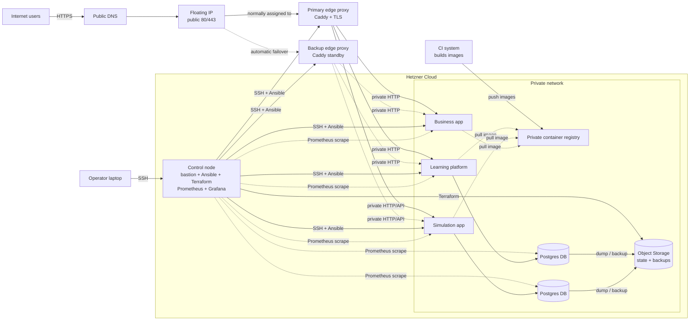
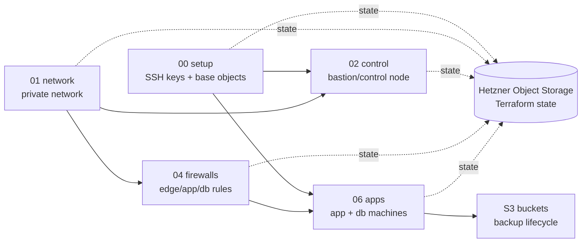
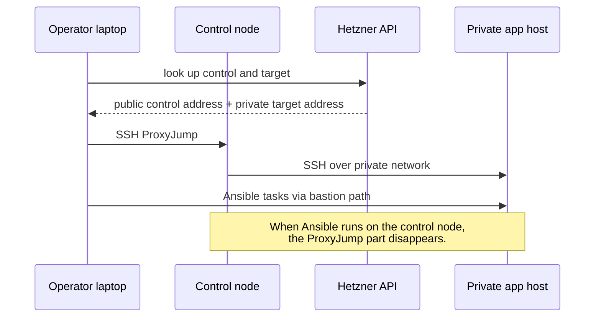

Migrating from AWS to Hetzner can lead to significant cost savings, especially beneficial for businesses with predictable traffic and smaller user bases. Obviously: AWS managed services are expensive partly because they do real work: snapshots, maintenance windows, easier restore flows, failover options, metrics, and fewer weird Saturday mornings. However, many of these functionalities can be reproduced, especially in a modest ecosystem.

To this day, people paste a pile of generated YAML into a terminal and call it system engineering. Pragmatic and sometimes fast, but it comes with two major drawbacks:

1. not re-usable
2. no implicit documentation

Using ansible and terraform gives us as _Infrastructure as Code_ (IaC): when done correctly bits and pieces are re-usable, the infrastructure becomes AI-agent compatible and IaC serves as an implicit architecture documentation. This migration was the quieter kind of work: move a modest production setup from AWS to Hetzner, keep the security shape understandable, make deployment repeatable, and cut the monthly bill by roughly **EUR 600** in this particular case.

## TL;DR

The old setup used AWS: elastic container services and registry, managed database and volumes, traffic rules and networks. It worked, but the bill was out of proportion for the workload and user bases.

The new setup uses:

- Hetzner Cloud servers for apps, databases, edge proxy, and control node.
- Caddy as the only public HTTP(S) entrypoint (edge proxy).
- A floating IP in front of the edge proxy, automatically moved to a backup edge node if the primary fails.
- One private network for server-to-server traffic.
- A control node as bastion, Ansible runner, Terraform workstation, Prometheus, and Grafana.
- Terraform for cloud resources.
- Ansible for machine state and Docker Compose deployments.
- Prometheus/Grafana monitoring applied automatically to the services during deployment.
- S3-compatible Hetzner Object Storage for Terraform state and backups.

No magic. That is the point. Small production systems often need boring reproducibility more than they need Kubernetes cosplay.



## Incentive

The client's ecosystem did not justify the expenses of AWS comforts -- especially because the comforts come with many discomforts: most bigger companies hire  employees who's solemn responibility is keeping the system alive, the complexity of AWS (and in fact other IaaS-providers) has skyrocketed the past 10 years. The benefits for a large microservice ecosystem that requires 100% uptime with load balancing and kubernetes are evident. For smaller services the additional spendings are hardly ever worth: fixed-price Hetzner machines do the same work.

The important bit is that the migration did not become a random collection of VPSes. Each host has a job:

| Part | Job |
| --- | --- |
| Edge proxy | Terminates TLS and routes public traffic to private services. |
| Control node | Single operator entrypoint, bastion, Ansible runner, Terraform runner. |
| App nodes | Run service-specific Docker Compose stacks. |
| DB nodes | Run Postgres for the matching app. |
| S3 Object storage | Holds Terraform state, database dumps, file backups, and application assets where needed. |

That separation is cheap on Hetzner and useful in real life. You can restart an app without touching its database. You can rebuild a service host without opening SSH to the internet. You can explain the setup to the next person in ten minutes without drawing a pentagram.

## Terraform: Infrastructure Setup

Terraform handles the pieces that belong to the provider:

- SSH keys
- private network
- control node
- firewalls
- app and DB servers
- volumes where persistent app data needs a mounted disk
- object storage buckets and lifecycle rules

The repository uses numbered Terraform stacks. That is not glamorous, but it makes dependency order obvious:



The nicest detail is the Terraform backend. State lives in Hetzner Object Storage through Terraform's S3 backend. The config is basically this, with real names removed:

```hcl
terraform {
  backend "s3" {
    bucket = "tf-state"
    key    = "network.tfstate"
    region = "region-a"

    endpoints = {
      s3 = "https://region-a.your-objectstorage.com"
    }

    skip_requesting_account_id  = true
    skip_credentials_validation = true
    skip_metadata_api_check     = true
    skip_region_validation      = true
  }
}
```

That works because Hetzner Object Storage is S3-compatible, but it is not AWS. Those skip flags matter. Without them, Terraform tries to ask AWS-flavoured questions that this backend does not answer.

## Ansible: Application Setup

The Ansible layout is the part I like most.

There is one inventory for topology: these are the logical hosts and groups. Then there are separate connection profiles depending on where Ansible runs.

From a workstation, Ansible reaches private hosts through the bastion:

```ini
# workstation profile
[bastion]
control ansible_host=<bastion-public-ip>

[nodes:vars]
ansible_user=root
ansible_ssh_common_args=-o ProxyJump=root@<bastion-public-ip>
ansible_ssh_private_key_file=~/.ssh/internal_ed25519
```

From the control node itself, the same logical hosts can be reached directly over the private network:

```
# control-node profile
[bastion]
control ansible_connection=local

[nodes:vars]
ansible_user=root
ansible_ssh_private_key_file=/home/ansible/.ssh/internal_ed25519
```

That sounds small until you have lived through the opposite. The opposite is five `README.md`s, three SSH aliases, and one person who knows which tunnel must be open during deploys.

There is also a useful dynamic pattern: query the Hetzner API for a server, extract its private address, then add it to an in-memory Ansible inventory with `add_host`. That means reprovisioned nodes do not require hand-editing private IPs into playbooks.



The roles are straightforward:

- `base_os` upgrades packages.
- `docker_host` installs Docker and Compose.
- service roles render `compose.yaml` and `.env`.
- secret-heavy templates use `no_log`.
- app containers bind to private interfaces.
- Caddy owns public TLS and routes traffic inward.
- Prometheus scrape targets and Grafana visibility are applied as part of the service deployment.

## Edge Proxy - a Single Entrypoint

For users, the single entrypoint is Caddy.

Public DNS points at one edge proxy. Caddy handles TLS and routes subdomains and paths to private services. The apps do not need public ports. The databases definitely do not need public ports.

In practice the public entrypoint is a floating IP, not the VM itself. Under normal conditions it sits on the primary Caddy node. If that node fails, automation moves the floating IP to a backup Caddy node with the same routing configuration. Users still hit the same DNS name and the same public address; the backing machine changes.

For operators, the single entrypoint is the control node.

That gives you two clean doors:

| Door | Who uses it | What it reaches |
| --- | --- | --- |
| Edge proxy | Browsers and API clients | Public web traffic only |
| Control node | Operators and automation | SSH, Ansible, Terraform |

This is the kind of split I want in small infrastructure. Not because it looks nice in a diagram, but because it reduces the amount of "wait, why can I reach that box from here?" during incident work.

## Backups

The sane shape is:

- database dumps go to object storage;
- app files go to object storage where needed;
- lifecycle rules expire old backup objects;
- restore playbooks exist and are treated as part of the system, not as emergency folklore.

Object storage is cheap enough that keeping backups there is an easy call. The hard part is discipline: test restores. A backup that has never been restored is no backup in production.

The setup also keeps backup storage in a separate object storage location from the compute region where practical. That is a simple, useful habit. It does not make a multi-region HA system, but it gives you a better failure story than "the same VM had the data and the backup".

## Why This Saved Money

The saving was around **EUR 500 per month** for this case.

The reason was not one clever trick. It was a stack of boring changes:

| Cost area | AWS-style setup | Hetzner setup |
| --- | --- | --- |
| Relational database | Managed database convenience, higher monthly baseline | Self-managed Postgres on small nodes |
| App hosting | Cloud services sized and priced for broader needs | Small fixed-size VMs |
| Backups | Provider snapshots and managed storage | S3-compatible object storage with lifecycle rules |
| Networking | Hyperscaler pricing model | Simpler private networking and edge proxy |

This does not mean "Hetzner is always cheaper" in some grand universal sense. If the client needs managed failover, point-in-time recovery, regional replication, a formal RTO, and a team that never wants to touch Postgres, AWS may still earn its money.

Here, the workload was small enough and understandable enough that self-managed infrastructure made sense.

## Advantages

The main advantage is cost, obviously. Cutting roughly EUR 500 per month matters for a small organization.

While AWS may also be configured with IaC, Hetzner offers no advanced user-interface for deployments. Thus the second advantage is forced readability and portability. Terraform shows the provider resources, these can easily be adjusted to a new provider. Then, Ansible shows how machines are configured. Compose files show what each app runs. There is no hidden machinery.

The third advantage is blast-radius control. App nodes, DB nodes, edge proxy, and control node have separate jobs. A broken app deploy does not need to become a broken database.

The fourth advantage is portability. A PostgreSQL dump, an object storage bucket, and a Compose project are not exotic. This makes future migrations less dramatic.

The fifth advantage is handover. Future operators can learn the shape from the repo instead of collecting server trivia from terminal history.

## Disadvantages

You lose managed-service comfort.

AWS managed databases are expensive partly because they do real work: snapshots, maintenance windows, easier restore flows, failover options, metrics, and fewer weird Saturday mornings. Moving to self-managed Postgres means you own that work.

The edge entrypoint is better than a plain single VM because the floating IP moves to a backup Caddy node on failure. That still needs testing, alerting, and a boring runbook. Failover that nobody has watched happen is just optimism with a nicer diagram.

The control node is also important. If it is down, the apps may keep running, but deploys and routine ops get annoying. That is acceptable for many small systems. It should be stated plainly.

Terraform state in S3-compatible storage is practical, but state locking and apply discipline need attention.

Docker Compose is a good fit here. It is not autoscaling, self-healing cluster magic. Again, good. But be honest about it.

## The Actual Skill

The skill is not "I know Terraform" or "I know Ansible". Plenty of people know the commands.

The skill is drawing the line in the right place:

- Terraform creates infrastructure.
- Ansible configures machines.
- Caddy is the only public web door.
- The control node is the only operator door.
- Apps talk privately.
- Databases stay private.
- Backups leave the machine.
- The cost model matches the size of the client.
